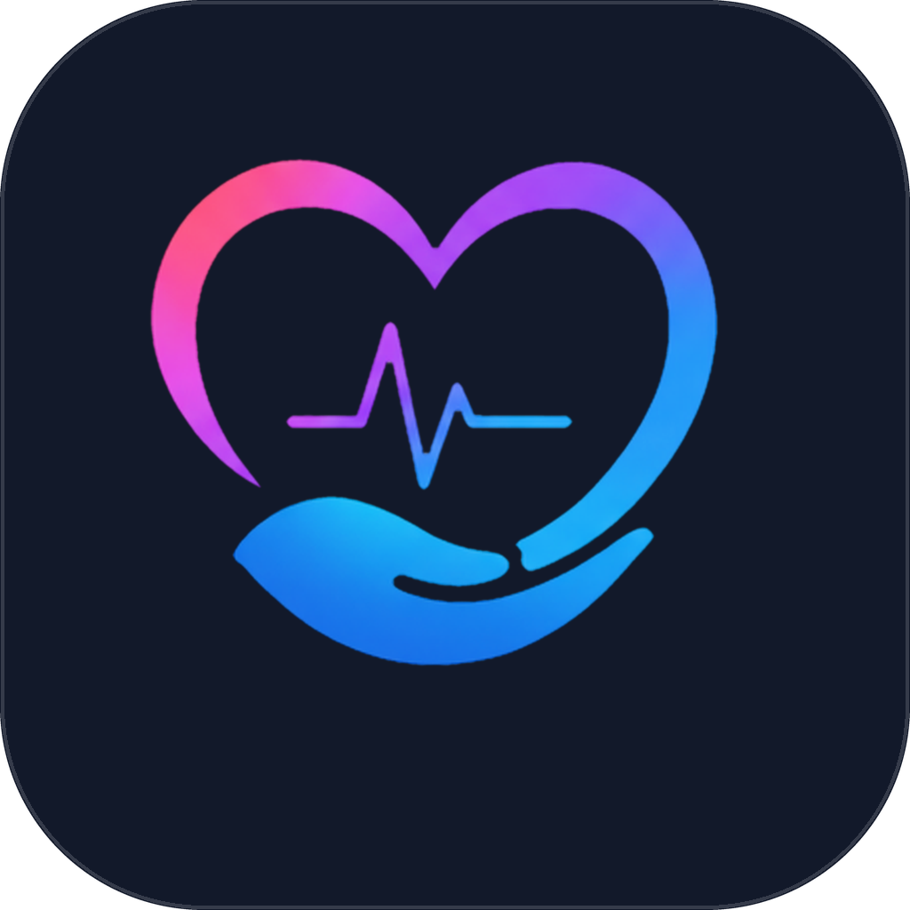

**🌐 Live website: [meftah7.github.io/myhealthcare_v2 →](https://meftah7.github.io/myhealthcare_v2/)**

<div align="center">



# MyHealth Care

**Your health records, appointments and care team — in one place.**

A Flutter healthcare project with dedicated patient, staff and admin workspaces.

<p>
  
  
  
  
</p>

<p>
  <a href="https://meftah7.github.io/myhealthcare_v2/"><strong>Open the live demo ↗</strong></a>
  &nbsp; · &nbsp; <a href="#demo-accounts">Demo accounts</a>
  &nbsp; · &nbsp; <a href="#quick-start">Quick start</a>
  &nbsp; · &nbsp; <a href="#documentation">Documentation</a>
</p>

**University of Bahrain · College of IT · Senior project**

</div>

---

## Explore the app

MyHealth Care brings personal health information and clinic workflows into one
application. Core records are stored locally with **Drift/SQLite**, and the demo
includes an offline AI implementation that needs no API key.

| Workspace | What you can do |
| --- | --- |
| **Patient** | Browse health records and vitals, book appointments, view upcoming appointment cards, message the care team, manage family links, review nutrition estimates and handle invoices. |
| **Staff** | Work through schedules and queues, open patient charts, complete consultations, review results, manage tasks and prepare visit-note drafts with the clinical scribe. |
| **Admin** | Manage users and departments, handle billing and service requests, review analytics and audit activity, and configure clinic and AI settings. |
| **Account & preferences** | Sign in and recover access, update profile details and photos, and choose language, appearance and text-size preferences. |

The interface supports **English and Arabic with RTL layouts**, light and dark
themes, high contrast and responsive navigation. Upcoming appointment cards support
swiping, previous/next controls and a four-second slideshow.

> [!NOTE]
> The hosted demo is a university prototype using **synthetic data**. Its records
> are stored in your browser; they are not a shared clinic database. See the
> [release scope and validation notes](docs/phase9_release_readiness.md).

## Demo accounts

**[Open the website](https://meftah7.github.io/myhealthcare_v2/)**, then sign in
with one of these accounts. All three use the password **`password`**.

| Workspace | Email | Suggested starting point |
| --- | --- | --- |
| Patient | `patient3@myhealth.demo` | Explore a patient with an extensive record history. |
| Staff | `staff1@myhealth.demo` | Explore the dashboard, schedule and patient charts. |
| Admin | `admin@myhealth.demo` | Explore clinic management and system settings. |

The demo seeds **60 patients, 12 staff and 5 departments**, with approximately two
years of clinical history. It initializes on first launch in demo mode. Admins can
also reset the dataset through **AI settings → Re-seed / reset demo data**.

For more accounts and example workflows, see [the demo account guide](docs/test_accounts.md).

## Quick start

Use the pinned **Flutter 3.44.4 / Dart 3.12.2** toolchain. The dependency lock and
GitHub Pages workflow use this version; see [the project plan](plan.md) for context.

```bash
git clone https://github.com/Meftah7/myhealthcare_v2.git
cd myhealthcare_v2
flutter pub get
flutter run -d chrome --dart-define=APP_MODE=demo
```

Generated sources are committed. After changing a database table, generated entity
or other code-generation input, regenerate them with:

```bash
dart run build_runner build --delete-conflicting-outputs
```

### Other platforms

| Platform | Additional requirements | Run command |
| --- | --- | --- |
| Windows | Visual Studio 2022 with **Desktop development with C++**. | `flutter run -d windows` |
| Android | Android SDK 35 and an emulator or a device with USB debugging. | `flutter run -d <device-id>` |
| iOS | macOS and the iOS development toolchain; configured but not verified here. | `flutter run -d <device-id>` |

Use `flutter devices` to find a device ID. Python 3.12+ is needed only for the
[offline ML training tools](tools/ml/README.md).

### Demo and production modes

| Mode | Behaviour |
| --- | --- |
| `demo` | Creates synthetic accounts and enables demo controls. Default for debug/profile builds. |
| `production` | Does not generate demo accounts and hides demo credentials and reseed controls. Default for release builds. |

Select the mode explicitly when building a demonstration:

```bash
flutter build web --release --dart-define=APP_MODE=demo
```

To build without demo seeding:

```bash
flutter build web --release --dart-define=APP_MODE=production
```

These modes control demo behaviour. The approved release scope and remaining
validation are documented in [release readiness](docs/phase9_release_readiness.md).

## AI configuration

The demo works without an API key through `MockAiService`. To configure the live
provider, open **Admin → AI settings**, enter a key and adjust the AI/mock settings.
Keys entered through the app use `flutter_secure_storage` and are not written to
source files.

See [AI setup](docs/ai_setup.md) for provider details. Keep API keys out of commits;
`.gitignore` excludes `*.env`, `secrets.dart` and `api_keys.dart`.

## Development checks

```bash
flutter analyze
dart format --set-exit-if-changed lib test integration_test test_driver
flutter test
```

The [small-phone readability audit](docs/SMALL_PHONE_READABILITY_AUDIT.md) records
the English/Arabic route checks at 320px, enlarged-text coverage, carousel tests
and remaining device/visual checks.

<details>
<summary><strong>Platform integration tests</strong></summary>

Run the Drift integration check on a desktop or Android target:

```bash
flutter test integration_test/drift_spike_test.dart -d windows
flutter test integration_test/drift_spike_test.dart -d <device-id>
```

Web integration tests use `flutter drive` and a matching ChromeDriver:

```bash
chromedriver --port=4444 &
flutter drive --driver=test_driver/integration_test.dart \
  --target=integration_test/drift_spike_test.dart \
  -d web-server --browser-name=chrome --release
```

</details>

## GitHub Pages deployment

The [deployment workflow](.github/workflows/static.yml) builds and publishes the
web app when changes are pushed to `main`, or when triggered manually.

Its build uses the repository’s Pages path and bundles web resources locally:

```bash
flutter build web --release \
  --base-href "/myhealthcare_v2/" \
  --no-web-resources-cdn \
  --dart-define=APP_MODE=demo
```

**Website:** [https://meftah7.github.io/myhealthcare_v2/](https://meftah7.github.io/myhealthcare_v2/)

For browser storage, Drift prefers OPFS with cross-origin isolation headers and
falls back to persistent IndexedDB when those headers are absent. Hosting details
and the required headers are in [the web storage guide](web/DRIFT_WEB.md).

## Project structure

```text
lib/
├── app/          App setup, routing, themes and adaptive navigation
├── core/         Shared widgets, dependency injection and result types
├── domain/       Entities and repository interfaces
├── data/         Drift database, DAOs, repositories and synthetic seeding
├── features/     Feature-specific presentation and application logic
└── services/     AI, ML prediction, notifications and PDF documents
assets/           Bundled fonts, images, icons, sounds and model assets
docs/             Design references, reports, audits and validation notes
test/             Unit, widget, workflow and regression tests
integration_test/ Platform integration checks
tools/ml/         Offline Python model training
```

## Documentation

| Topic | Guide |
| --- | --- |
| Planning and progress | [Project plan](plan.md) · [Task breakdown](tasks.md) · [Project checklist](docs/PROJECT_CHECKLIST.md) |
| Design and UI | [Design system](DESIGN.md) · [Redesign reference](docs/figma-redesign/README.md) · [Small-phone audit](docs/SMALL_PHONE_READABILITY_AUDIT.md) |
| Demo and AI | [Test accounts](docs/test_accounts.md) · [AI setup](docs/ai_setup.md) · [ML tools](tools/ml/README.md) |
| Platforms and release | [Web storage](web/DRIFT_WEB.md) · [Platform smoke checks](docs/platform_smoke.md) · [Release readiness](docs/phase9_release_readiness.md) |
| Project reports | [Project report](docs/MyHealthCare_Project_Report.pdf) · [Feature report](docs/MyHealthCare_Feature_Report.pdf) |

## Research and team

This senior project at the **University of Bahrain, College of IT** explores:

| Research question | Focus |
| --- | --- |
| **RQ1** | Bring reports, clinical notes and vitals into a unified health profile with meaningful trends. |
| **RQ2** | Support appointment scheduling with no-show prediction and adaptive reminders. |
| **RQ3** | Support staff task prioritisation and identification of patients needing attention. |

**Developed by** Ali Mohamed Jaafar Mohamed (202208244) and Mohammed A.Redha Meftah
(202209027). **Supervised by** Dr. Amal Ghanim.
