# MyHealth Care — System Diagrams

Diagrams for the project report, derived from the code (schema v29, 46 tables,
339 Dart files). All are Mermaid; GitHub renders them inline, and
[mermaid.live](https://mermaid.live) exports PNG/SVG for the report.

1. [Layered architecture](#1-layered-architecture)
2. [Deployment / runtime](#2-deployment--runtime)
3. [Use cases](#3-use-cases)
4. [Entity relationship (full schema)](#4-entity-relationship-full-schema)
5. [Sequence — sign-in and role routing](#5-sequence--sign-in-and-role-routing)
6. [Sequence — booking with no-show prediction (RQ2)](#6-sequence--booking-with-no-show-prediction-rq2)
7. [Sequence — AI health summary (RQ1)](#7-sequence--ai-health-summary-rq1)
8. [Sequence — consultation to signed note](#8-sequence--consultation-to-signed-note)
9. [Activity — risk detection and task prioritisation (RQ3)](#9-activity--risk-detection-and-task-prioritisation-rq3)
10. [State — appointment lifecycle](#10-state--appointment-lifecycle)
11. [State — walk-in ticket and invoice](#11-state--walk-in-ticket-and-invoice)
12. [Transactional outbox](#12-transactional-outbox)
13. [ML pipeline (offline training → on-device inference)](#13-ml-pipeline-offline-training--on-device-inference)

---

## 1. Layered architecture

Feature-first presentation over a domain/data core. Features depend only on
domain interfaces; Drift is the single implementation behind them.

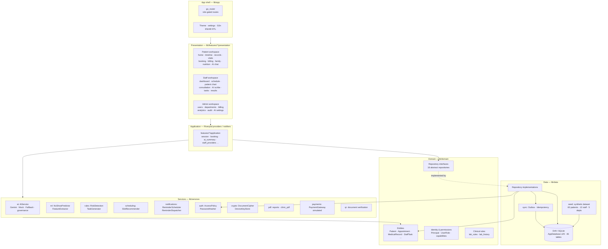

## 2. Deployment / runtime

Offline-first: every platform runs the full stack against a local database.
The only network calls are optional (Gemini API).

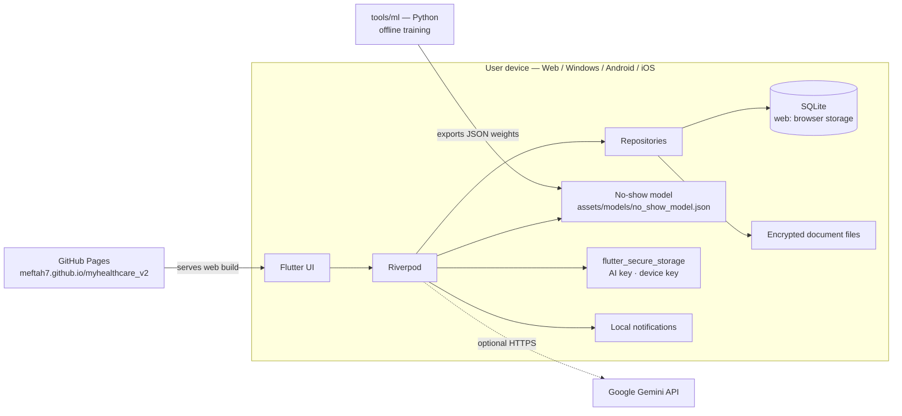

## 3. Use cases

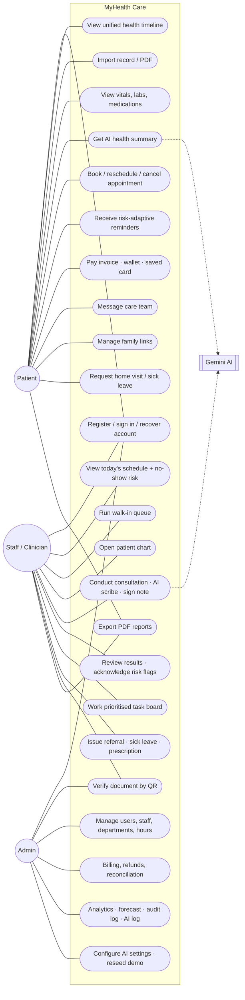

## 4. Entity relationship (full schema)

All 46 tables, grouped by `lib/data/db/tables/*.dart`. Columns are limited to
keys and the most important fields.

```mermaid
erDiagram
  %% Identity (users.dart, identity.dart, family.dart)
  departments ||--o{ staff_profiles : staffs
  users ||--o| patient_profiles : has
  users ||--o| staff_profiles : has
  users ||--o{ staff_credentials : holds
  users ||--o{ care_team_assignments : "assigned to"
  users ||--o{ family_links : links
  users ||--o{ account_recovery_tokens : recovers
  users ||--o{ password_reset_requests : requests

  %% Scheduling (appointments.dart)
  users ||--o{ schedule_templates : "works per"
  users ||--o{ availability_exceptions : "is away"
  users ||--o{ appointments : "patient / staff"
  departments ||--o{ appointments : hosts
  appointments ||--o{ reminders : triggers

  %% Clinical records (records.dart)
  users ||--o{ medical_records : "owns / authors"
  appointments |o--o{ medical_records : produces
  medical_records ||--o{ lab_values : contains
  medical_records ||--o{ document_files : attaches
  medical_records ||--o{ record_reads : "read by"
  medical_records ||--o{ record_corrections : "corrected by"
  medical_records ||--o{ result_reviews : "reviewed in"
  users ||--o{ vitals : records
  users ||--o{ medications : "prescribed / takes"
  appointments ||--o| encounter_drafts : drafts
  appointments ||--o| signed_notes : "signed as"
  signed_notes ||--o{ signed_note_amendments : amends
  users ||--o{ document_verifications : issues

  %% Care services (care.dart)
  appointments |o--o{ sick_leave_certificates : issues
  appointments |o--o{ referral_requests : refers
  departments ||--o{ walk_in_tickets : queues
  walk_in_tickets |o--o| appointments : "becomes"
  departments ||--o{ home_visit_requests : serves
  users ||--o{ care_messages : sends

  %% Billing (billing.dart)
  appointments |o--o{ invoices : bills
  users ||--o{ invoices : owes
  invoices ||--o{ payment_transactions : "paid by"
  invoices |o--o{ wallet_transactions : settles
  users ||--o{ payment_methods : saves
  users ||--o{ simulated_gateway_charges : charged

  %% AI and rules (ai.dart)
  users ||--o{ ai_summaries : summarised
  users ||--o{ staff_tasks : "assigned / about"
  users ||--o{ risk_flags : flagged
  users ||--o{ risk_source_aliases : aliases

  %% System (system.dart, sync.dart, notifications.dart)
  users ||--o{ notifications : receives
  users ||--o{ audit_log : performs
  users ||--o{ ai_usage_log : uses
  users ||--o{ feedbacks : reports
  outbox_events }o..o{ notifications : delivers
  idempotency_records }o..|| users : guards
  app_settings ||..|| app_settings : singleton

  users {
    text id PK
    text role "patient|staff|admin"
    text email
    text passwordHash
    bool isActive
  }
  appointments {
    text id PK
    text patientId FK
    text staffId FK
    text departmentId FK
    datetime slotStart
    text status
    real noShowRisk
    text riskBand
  }
  medical_records {
    text id PK
    text patientId FK
    text authorStaffId FK
    text appointmentId FK
    text recordType
    datetime occurredAt
  }
  lab_values {
    text id PK
    text recordId FK
    text analyte
    real value
    text unit
  }
  invoices {
    text id PK
    text patientId FK
    text appointmentId FK
    real amount
    text status
  }
  ai_summaries {
    text id PK
    text patientId FK
    text inputHash
    text modelId
    text promptVersion
  }
  staff_tasks {
    text id PK
    text staffId FK
    text patientId FK
    text status
    real ruleScore
  }
  risk_flags {
    text id PK
    text patientId FK
    text severity
    text source "rule|ai"
    text acknowledgedBy FK
  }
```

## 5. Sequence — sign-in and role routing

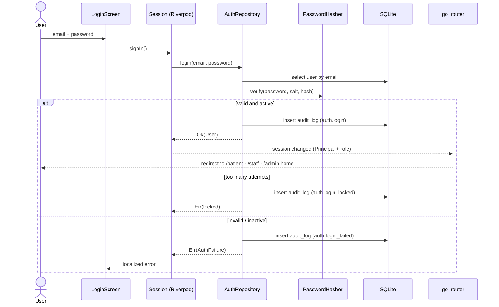

## 6. Sequence — booking with no-show prediction (RQ2)

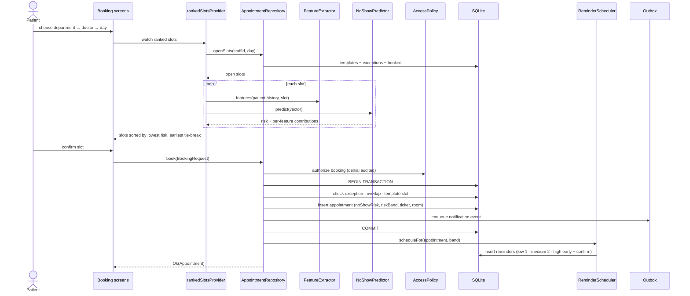

## 7. Sequence — AI health summary (RQ1)

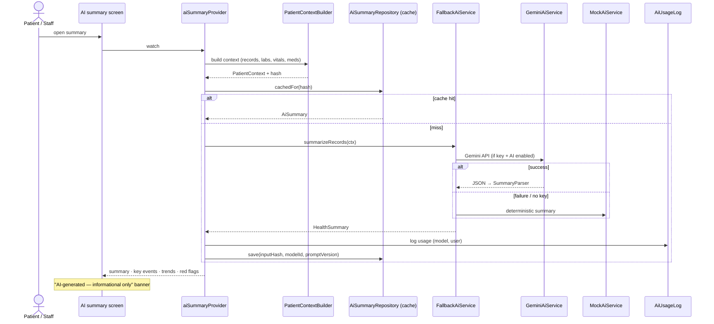

## 8. Sequence — consultation to signed note

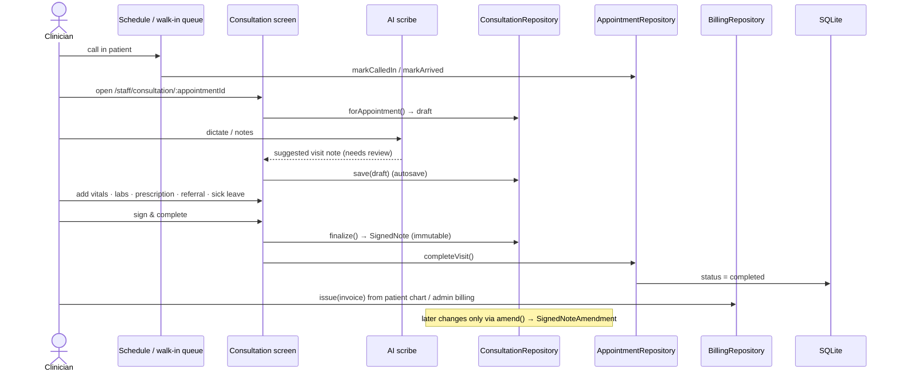

## 9. Activity — risk detection and task prioritisation (RQ3)

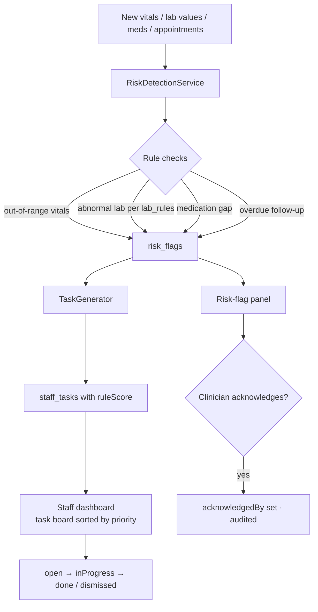

## 10. State — appointment lifecycle

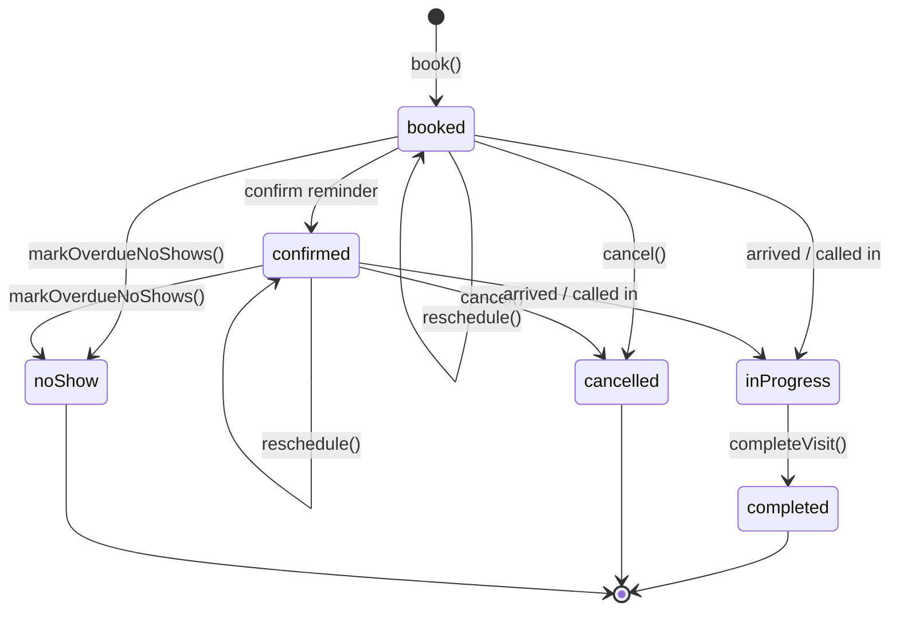

## 11. State — walk-in ticket and invoice

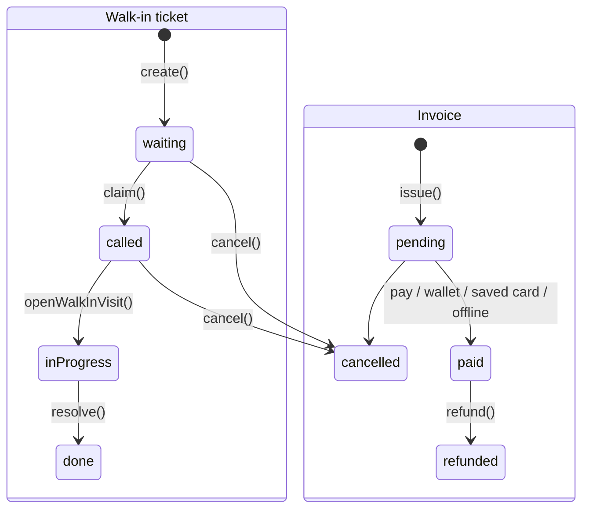

## 12. Transactional outbox

A change and its side effect commit together; delivery happens later and
never blocks or undoes the change.

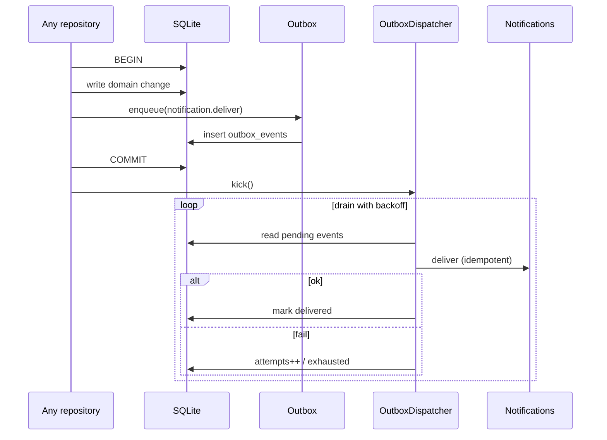

## 13. ML pipeline (offline training → on-device inference)

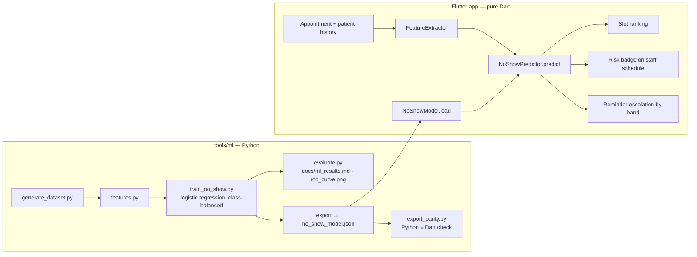
