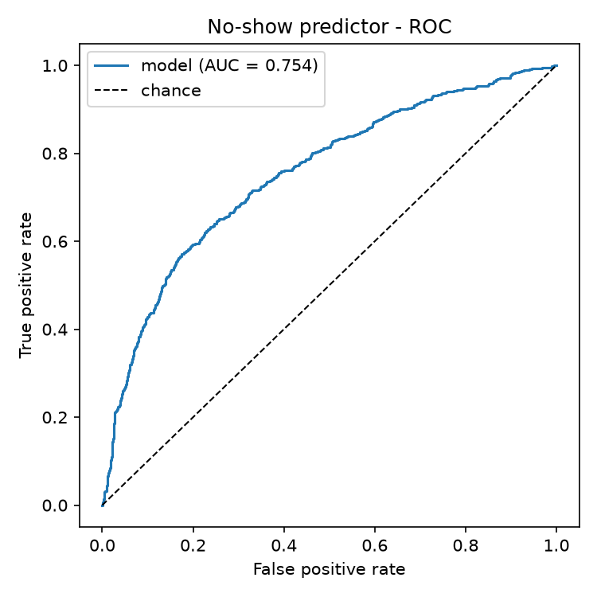

# No-show predictor - results (RQ2)

Model: `no-show-v1` - class-balanced logistic regression
Test set: 2145 appointments - no-show rate 25.1%

## Metrics

| Model | Accuracy | Precision | Recall | F1 | ROC-AUC |
|---|---|---|---|---|---|
| Logistic regression | 0.733 | 0.476 | 0.623 | 0.540 | 0.754 |
| Baseline: majority class | 0.749 | 0.000 | 0.000 | 0.000 | nan |
| Baseline: simple heuristic | 0.698 | 0.433 | 0.653 | 0.521 | 0.683 |

## Confusion matrix (model, threshold 0.5)

| | pred attend | pred no-show |
|---|---|---|
| **actual attend** | 1236 | 370 |
| **actual no-show** | 203 | 336 |

## Feature coefficients (scaled)

| Feature | Coefficient |
|---|---|
| prior_no_show_rate | +1.020 |
| lead_time_days | +0.351 |
| is_first_visit | +0.278 |
| has_chronic_condition | -0.166 |
| prior_appointment_count | +0.070 |
| reminders_acknowledged | +0.045 |
| hour_of_day | -0.031 |
| day_of_week | +0.031 |
| visit_type_urgent | -0.020 |
| visit_type_routine | -0.014 |
| age_years | +0.004 |

Intercept: -0.212

